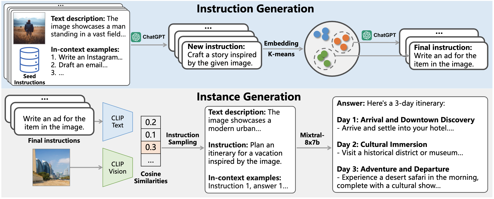

# MM-Instruct: Generated Visual Instructions for Large Multimodal Model Alignment

<div align="center">

[](https://arxiv.org/abs/2406.19736) [](https://huggingface.co/datasets/jjjjh/MM-Instruct)



</div>

This repository contains the code, models, and data for the paper [MM-Instruct: Generated Visual Instructions for Large Multimodal Model Alignment](https://github.com/jihaonew/MM-Instruct).

## Abstract:

This paper introduces MM-Instruct, a large-scale dataset of diverse and high-quality visual instruction data designed to enhance the instruction-following capabilities of large multimodal models (LMMs). While existing visual instruction datasets often focus on question-answering, they struggle to generalize to broader application scenarios such as creative writing, summarization, or image analysis. To address these limitations, we propose a novel approach to constructing MM-Instruct that leverages the strong instruction-following capabilities of existing LLMs to generate novel visual instruction data from large-scale but conventional image captioning datasets. MM-Instruct first leverages ChatGPT to automatically generate diverse instructions from a small set of seed instructions through augmenting and summarization. It then matches these instructions with images and uses an open-sourced large language model (LLM) to generate coherent answers to the instruction-image pairs. The LLM is grounded by the detailed text descriptions of images in the whole answer generation process to guarantee the alignment of the instruction data. Moreover, we introduce a benchmark based on the generated instruction data to evaluate the instruction-following capabilities of existing LMMs. We demonstrate the effectiveness of MM-Instruct by training a LLaVA-1.5 model on the generated data, denoted as LLaVA-Instruct, which exhibits significant improvements in instruction-following capabilities compared to LLaVA-1.5 models.

## Key Features

- **Diverse Instructions**: MM-Instruct goes beyond simple question-answering, covering a wide range of instructions including creative writing, summarization, and image analysis.
- **High-Quality**: Instructions and answers are carefully generated and filtered for coherence and alignment with image content.
- **Automated Pipeline**: We provide an automated pipeline for data generation.
- **Benchmark for Evaluation**: A held-out subset of MM-Instruct serves as a benchmark for evaluating the instruction-following capabilities of LMMs.

## Dataset

The MM-Instruct dataset consists of 234k high-quality visual instruction-answer pairs derived from image captioning datasets. You can download it on [huggingface](https://huggingface.co/datasets/jjjjh/MM-Instruct).

## Models:

We release 7B/13B models trained with LLaVA framework.

| Model           | Link                                  |
| --------------- | ------------------------------------- |
| MM-Instruct-7B  | [weights](https://huggingface.co/jjjjh/MM-Instruct/tree/main/7b_model) |
| MM-Instruct-13B | [weights](https://huggingface.co/jjjjh/MM-Instruct/tree/main/13b_model) |

## Install

If you are not using Linux, do *NOT* proceed, see instructions for [macOS](docs/macOS.md) and [Windows](docs/Windows.md).

1. Clone this repository and navigate to MM-Instruct folder

```bash
git clone https://github.com/jihaonew/MM-Instruct.git
cd MM-Instruct
```

1. Install Package

```Shell
conda create -n llava python=3.10 -y
conda activate llava
pip install --upgrade pip  # enable PEP 660 support
pip install -e .
```

1. Install additional packages for training cases

```Shell
pip install -e ".[train]"
pip install flash-attn --no-build-isolation
```

### Upgrade to latest code base

```Shell
git pull
pip install -e .

# if you see some import errors when you upgrade,
# please try running the command below (without #)
# pip install flash-attn --no-build-isolation --no-cache-dir
```

## Train

We follow original LLaVA for training and evaluation. On exception is that we use our generated data in the instruction tuning stage. LLaVA training consists of two stages: (1) feature alignment stage: use our 558K subset of the LAION-CC-SBU dataset to connect a *frozen pretrained* vision encoder to a *frozen LLM*; (2) visual instruction tuning stage: use 150K GPT-generated multimodal instruction-following data, around 515K VQA data from academic-oriented tasks, and 234K our generated instruction-tuning data to teach the model to follow multimodal instructions.

LLaVA is trained on 8 A100 GPUs with 80GB memory. To train on fewer GPUs, you can reduce the `per_device_train_batch_size` and increase the `gradient_accumulation_steps` accordingly. Always keep the global batch size the same: `per_device_train_batch_size` x `gradient_accumulation_steps` x `num_gpus`.

### Hyperparameters

We use a similar set of hyperparameters as Vicuna in finetuning.  Both hyperparameters used in pretraining and finetuning are provided below.

1. Pretraining

| Hyperparameter | Global Batch Size | Learning rate | Epochs | Max length | Weight decay |
| -------------- | ----------------: | ------------: | -----: | ---------: | -----------: |
| LLaVA-v1.5-13B |               256 |          1e-3 |      1 |       2048 |            0 |

2. Finetuning

| Hyperparameter | Global Batch Size | Learning rate | Epochs | Max length | Weight decay |
| -------------- | ----------------: | ------------: | -----: | ---------: | -----------: |
| LLaVA-v1.5-13B |               128 |          2e-5 |      1 |       2048 |            0 |

### Download Vicuna checkpoints (automatically)

Our base model Vicuna v1.5, which is an instruction-tuned chatbot, will be downloaded automatically when you run our provided training scripts. No action is needed.

### Pretrain (feature alignment)

Please download the 558K subset of the LAION-CC-SBU dataset with BLIP captions we use in the paper [here](https://huggingface.co/datasets/liuhaotian/LLaVA-Pretrain).

Pretrain takes around 5.5 hours for LLaVA-v1.5-13B on 8x A100 (80G), due to the increased resolution to 336px. It takes around 3.5 hours for LLaVA-v1.5-7B.

Training script with DeepSpeed ZeRO-2: [`pretrain.sh`](scripts/v1_5/pretrain.sh).

- `--mm_projector_type mlp2x_gelu`: the two-layer MLP vision-language connector.
- `--vision_tower openai/clip-vit-large-patch14-336`: CLIP ViT-L/14 336px.

<details>
<summary>Pretrain takes around 20 hours for LLaVA-7B on 8x V100 (32G)</summary>

 We provide training script with DeepSpeed [here](scripts/pretrain_xformers.sh).
Tips:

- If you are using V100 which is not supported by FlashAttention, you can use the [memory-efficient attention](https://arxiv.org/abs/2112.05682) implemented in [xFormers](https://github.com/facebookresearch/xformers). Install xformers and replace `llava/train/train_mem.py` above with [llava/train/train_xformers.py](llava/train/train_xformers.py).

</details>

### Visual Instruction Tuning

1. Prepare data

Download the annotation of the final mixture instruction tuning data [llava_v1_5_mix665k.json](https://huggingface.co/datasets/liuhaotian/LLaVA-Instruct-150K/blob/main/llava_v1_5_mix665k.json) from LLaVA. Download our generated instruction-tuning data [mm_instruct_234k](https://huggingface.co/datasets/jjjjh/MM-Instruct) and combine them with llava_v1_5_mix665k using the [script](scripts/combine_data.py).

and download the images from constituting datasets:

- COCO: [train2017](http://images.cocodataset.org/zips/train2017.zip)
- GQA: [images](https://downloads.cs.stanford.edu/nlp/data/gqa/images.zip)
- OCR-VQA: [download script](https://drive.google.com/drive/folders/1_GYPY5UkUy7HIcR0zq3ZCFgeZN7BAfm_?usp=sharing), **we save all files as `.jpg`**
- TextVQA: [train_val_images](https://dl.fbaipublicfiles.com/textvqa/images/train_val_images.zip)
- VisualGenome: [part1](https://cs.stanford.edu/people/rak248/VG_100K_2/images.zip), [part2](https://cs.stanford.edu/people/rak248/VG_100K_2/images2.zip)
- datacomp_1b: [datacomp_1b](https://huggingface.co/datasets/mlfoundations/datacomp_1b)
- sa_1b: [sa_1b](https://ai.meta.com/datasets/segment-anything-downloads/)

After downloading all of them, organize the data as follows in `./playground/data`,

```
├── coco
│   └── train2017
├── gqa
│   └── images
├── ocr_vqa
│   └── images
├── textvqa
│   └── train_images
├── datacomp
│   └── images
├── sa1b
└── vg
    ├── VG_100K
    └── VG_100K_2
```

1. Start training!

You may download our pretrained projectors in [Model Zoo](docs/MODEL_ZOO.md). It is not recommended to use legacy projectors, as they may be trained with a different version of the codebase, and if any option is off, the model will not function/train as we expected.

Visual instruction tuning takes around 20 hours for LLaVA-v1.5-13B on 8x A100 (80G), due to the increased resolution to 336px. It takes around 10 hours for LLaVA-v1.5-7B on 8x A100 (40G).

Training script with DeepSpeed ZeRO-3: [`finetune.sh`](scripts/v1_5/finetune.sh).

If you are do not have enough GPU memory:

- Use LoRA: [`finetune_lora.sh`](scripts/v1_5/finetune_lora.sh). We are able to fit 13B training in 8-A100-40G/8-A6000, and 7B training in 8-RTX3090. Make sure `per_device_train_batch_size*gradient_accumulation_steps` is the same as the provided script for best reproducibility.
- Replace `zero3.json` with `zero3_offload.json` which offloads some parameters to CPU RAM. This slows down the training speed.

If you are interested in finetuning LLaVA model to your own task/data, please check out [`Finetune_Custom_Data.md`](docs/Finetune_Custom_Data.md)。

New options to note:

- `--mm_projector_type mlp2x_gelu`: the two-layer MLP vision-language connector.
- `--vision_tower openai/clip-vit-large-patch14-336`: CLIP ViT-L/14 336px.
- `--image_aspect_ratio pad`: this pads the non-square images to square, instead of cropping them; it slightly reduces hallucination.
- `--group_by_modality_length True`: this should only be used when your instruction tuning dataset contains both language (e.g. ShareGPT) and multimodal (e.g. LLaVA-Instruct). It makes the training sampler only sample a single modality (either image or language) during training, which we observe to speed up training by ~25%, and does not affect the final outcome.

## Evaluation

### Evaluation On Existing Benchmarks

We firstly evaluate our MM-Instruct Model on existing 12 benchmarks following LLaVA-1.5. To ensure the reproducibility, we evaluate the models with greedy decoding. We do not evaluate using beam search to make the inference process consistent with the chat demo of real-time outputs. See [Evaluation.md](docs/Evaluation.md).

### GPT-assisted Evaluation of Instruction-Following Capability

Besides the evalution in LLaVA-1.5, we provide an extra dataset to evaluate the intruction-following capabilities of LMMs. Our GPT-assisted evaluation of Instruction-Following Capability is provided for thoroughly examining the instruction-following capabilities of LMMs,.  Please see our paper for more details.

Please follow the following steps to evaluate your model.

1. Data preparation
   Firstly download the test [image](https://huggingface.co/datasets/jjjjh/MM-Instruct/tree/main)
2. Generate responses of your own model

```Shell
python model_vqa.py \
    --model-path ./checkpoints/LLaVA-13B-v0 \
    --question-file \
    ./llava/eval/MM-Instruct-eval/MM-Instruct-Eval-question.json \
    --image-folder \
    /path/to/eval_image \
    --answers-file \
    /path/to/answer-file-our.json
```

3. Evaluate the generated responses by comparing the your answer with the baseline result(Eg. GPT4-V here). We provide results from `GPT4-V`, `Gemini-Pro`, `CogVLM`, `Instruct-BLIP`, `LLaVA-1.5`, `Qwen-VL`

```Shell
OPENAI_API_KEY="sk-***********************************" 
python llava/eval/mminstruct-eval-gpt4v.py \
    --image-folder /path/to/eval_image \
    --question llava/eval/MM-Instruct-eval/MM-Instruct-Eval-question.json \
    --m1 /path/to/answer-file-our.json \
    --m2 ./llava/eval/MM-Instruct-eval/baseline_answers/gpt4v.json
```

## **Citation:**

If you find this work helpful, please cite our paper:

```
@misc{liu2024mminstructgeneratedvisualinstructions,
      title={MM-Instruct: Generated Visual Instructions for Large Multimodal Model Alignment}, 
      author={Jihao Liu and Xin Huang and Jinliang Zheng and Boxiao Liu and Jia Wang and Osamu Yoshie and Yu Liu and Hongsheng Li},
      year={2024},
      eprint={2406.19736},
      archivePrefix={arXiv},
      primaryClass={cs.CV},
      url={https://arxiv.org/abs/2406.19736}, 
}
```

## Contributing:

Contributions to this repository are welcome. Please feel free to open an issue or submit a pull request.
